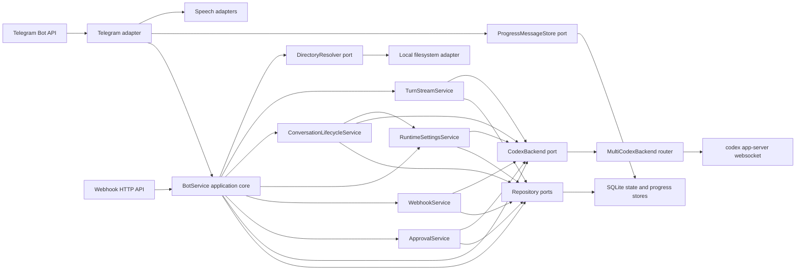
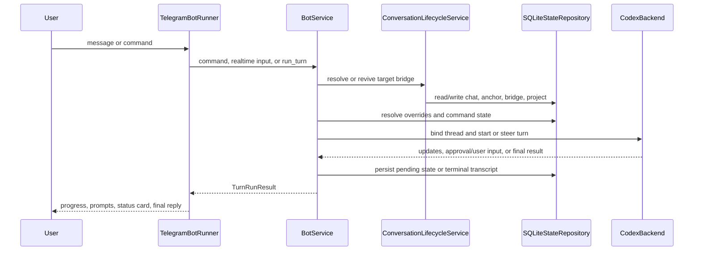

# Architecture

This document describes the current architecture of `codex-telegram` from the
repository's code, durable docs, and runtime configuration.

## Table Of Contents

- project overview: L20-L30
- architecture overview: L32-L112
- boundaries and invariants: L114-L133
- repository mapping: L135-L164
- components: L166-L336
- data and control flow: L338-L369
- public surfaces: L371-L381
- extension points: L383-L401
- testing and verification: L403-L431
- change management: L433-L444
- architecture discussion: L446-L515

## Project Overview

`codex-telegram` is a standalone async Python service that exposes Codex through
Telegram. Telegram is the client shell, `codex app-server` is the only agent
backend, and this repository intentionally keeps third-party automation bridges
out of the app code.

The main process owns Telegram long polling, optional webhook HTTP endpoints,
SQLite-backed application state, speech-to-text input when enabled, external
webhook dispatch, and a websocket client for one or more configured `codex
app-server` connections.

## Architecture Overview

The system is organized around stable domain/application models with unstable
transport and runtime edges around them:

Product shape:

- `BotService` is the application facade for turn-start orchestration, realtime,
  project/directory command facades, and compatibility-facing application APIs.
- `ConversationLifecycleService` owns durable conversation anchors, short-lived
  bridge windows, thread focus, anchor revival, Codex-thread attachment, and
  bridge expiry policy.
- `ApprovalService` owns pending approval and user-input resolution policy.
- `WebhookService` owns webhook subscription and event acceptance policy.
- `RuntimeSettingsService` owns profile resolution, effective settings, project
  selection, and project-scoped runtime overrides.
- `TurnStreamService` owns app-server turn stream collection and terminal
  transcript persistence.
- `CodexBackend` hides app-server websocket details behind application-facing
  methods and stable domain models.
- Repository ports hide SQLite behind logical chat, bridge, anchor, project,
  webhook, pending-request, transcript, and delivery bookkeeping operations.
  Extracted application services depend on narrow service-owned repository
  protocols instead of the full `StateRepository`.
- `DirectoryResolver` hides local filesystem path expansion and directory
  validation from directory and Project command policy.
- `TelegramBotRunner` owns Telegram intake, command delegation, callback
  buttons, typing/progress/final delivery, background expiry, and attachment
  delivery.
- `adapters/telegram/routing.py` owns Telegram chat-key routing helpers and the
  SDK-free `ChatContext` shape used inside the adapter.
- `adapters/telegram/commands.py` owns slash-command tokenization, shared
  option parsing, and slash-command execution for Telegram command inputs.
- `adapters/telegram/callbacks.py` owns callback-query token routing, expiration
  responses, callback error answering, callback action execution, and callback
  payload parsing helpers.
- `adapters/telegram/attachments.py` owns queued attachment job delivery,
  attachment path validation, and Telegram photo/document selection.
- `adapters/telegram/media_input.py` owns Telegram image input resolution,
  voice/audio download and transcription, and media-specific user feedback.
- `adapters/telegram/status_card.py` owns pinned overview/status-card creation,
  editing, replacement, and pin reconciliation.
- `adapters/telegram/errors.py` owns small Telegram API error classifiers shared
  by delivery and status-card code.
- `adapters/telegram/rendering.py` owns Telegram text rendering, command help
  text, message truncation/coalescing, and Codex-thread listing presentation.
- `entrypoints/bot.py` is the composition root for config, HTTP sessions,
  adapters, app services, and optional webhook hosting.

## Boundaries And Invariants

- The app code must stay Codex-only and deployment-agnostic.
  `src/codex_telegram` does not own unrelated automation APIs or event schemas.
- `ConversationAnchor` is the durable chat-to-Codex-thread binding. `BridgeThread`
  is a short-lived Telegram presentation window over an anchor. `LogicalThread`
  remains as a compatibility shape around bridge-window state.
- A thread's `codex_backend_id` pins work to one app-server connection. Project
  roots are scoped by backend connection, not by path alone.
- App-server protocol payloads should terminate in
  `adapters/codex_app_server/`; Telegram SDK types should terminate in
  `adapters/telegram/`.
- SQLite owns only application state: chat focus, anchors, bridge windows,
  pending requests, settings overrides, transcript snippets, project bindings,
  webhook subscriptions, callback tokens, progress/status cards, and attachment
  jobs. Codex conversation history remains app-server state.
- Retained legacy paths, their owners, and their removal conditions are tracked
  in `docs/compatibility.md`.
- Logging is structured through `observability.py` with stable event names,
  top-level correlation fields, and object-shaped `v` payloads.

## Repository Mapping

- `src/codex_telegram/domain/`: frozen dataclasses and stable identity/state
  models. This layer should not import adapters or runtime libraries.
- `src/codex_telegram/application/`: service orchestration, conversation
  lifecycle, approval/user-input resolution, webhook subscription/event
  acceptance, runtime settings/project policy, turn stream collection,
  application read models, service-owned repository protocols, and shared
  adapter ports. It depends on domain models and ports, and should avoid
  transport SDK types.
- `src/codex_telegram/adapters/codex_app_server/`: websocket JSON-RPC
  translation, request/notification routing, runtime state capture, backend
  routing, and app-server concurrency locks.
- `src/codex_telegram/adapters/filesystem.py`: local filesystem path resolution
  for directory and Project commands.
- `src/codex_telegram/adapters/persistence/`: SQLite schema, migrations, and
  repository implementations for app-owned state.
- `src/codex_telegram/adapters/telegram/`: Telegram message/callback handling,
  chat routing helpers, command execution helpers, callback token routing, text
  rendering, retry/backoff, status-card synchronization, attachment delivery,
  voice input intake, and shared Telegram error classifiers.
- `src/codex_telegram/adapters/speech_to_text/`: optional transcription clients
  for OpenAI-compatible and Codex internal transcription endpoints.
- `src/codex_telegram/entrypoints/`: process wiring, smoke tooling, webhook app,
  and attachment-queue CLI surfaces.
- `deploy/`, `docker-compose.yaml`, and `scripts/`: runtime image, sidecar,
  optional Tailscale or reverse-proxy exposure, and operational helpers.
- `tests/`: fast unit and adapter tests for service behavior, websocket
  protocol mapping, SQLite state, Telegram rendering/runner behavior, webhook
  routes, config, speech input, and runtime layout.

## Components

### Domain Models

Domain models in `domain/models.py` define the stable vocabulary: profiles,
session overrides, user-turn inputs, conversation anchors, bridge windows,
Codex threads, transcript entries, projects, webhooks, approvals, user-input
questions, realtime sessions/events, goals, and turn updates/results.

These types are mostly immutable and technology-neutral. Some names still carry
Telegram-facing history, especially `LogicalThread`, but the model distinction
between durable anchors and short-lived bridge windows is explicit.

### Application Core

`BotService` in `application/service.py` is the current application facade for
Telegram-facing workflows. It initializes durable state, routes normal turns and
webhook-triggered turns, handles steering and interruption, manages realtime
sessions, exposes project/directory command facades, and delegates narrower
policy domains to dedicated application services.

The service depends on `StateRepository` and `CodexBackend` protocols from
`application/ports.py`, so persistence and app-server transport are replaceable
at the boundary. The main architectural concern is breadth: many distinct
subdomains still pass through one facade even though lifecycle, approvals,
webhooks, settings, and stream collection have dedicated owners.

### Conversation Lifecycle Service

`ConversationLifecycleService` in `application/conversations.py` owns durable
conversation anchors and short-lived bridge-window policy. It creates focused
bridge windows, binds new windows to Projects, attaches existing Codex backend
threads, revives expired anchor-backed bridges, lists/backfills conversation
anchors, resolves user selectors, and expires idle bridge windows.

This keeps anchor/bridge identity and expiry rules in one application-layer
component. The service depends on a narrow `ConversationRepository` protocol.
`BotService` preserves the existing public methods as a compatibility facade,
while turn start, realtime, webhooks, and command flows ask this service to
resolve the target bridge.

### Approval Service

`ApprovalService` in `application/approvals.py` owns the user-action policy for
pending app-server approval and user-input requests. It reads and clears pending
state through `ApprovalRepository`, sends normalized responses through
`CodexBackend.resolve_server_request()`, and returns stable user-facing result
messages to the Telegram adapter through `BotService`'s compatibility facade.

This extraction gives approval/user-input resolution a clear application-layer
owner without changing the Telegram-facing `BotService` API.

### Webhook Service

`WebhookService` in `application/webhooks.py` owns durable webhook subscription
creation, listing, revocation, event-secret validation, idempotency, and event
prompt normalization. It uses `WebhookRepository` for app-owned webhook state,
uses `CodexBackend.resolve_backend_id()` when a subscription is attached by
backend thread id, and depends on a narrow focused-bridge provider for the
default "current conversation" subscription path.

`BotService.run_webhook_turn()` still owns delivery of an accepted webhook event
into the normal turn flow, while bridge revival is delegated to
`ConversationLifecycleService`.

### Runtime Settings Service

`RuntimeSettingsService` in `application/settings.py` owns profile resolution,
effective setting construction, override validation, fast-mode updates,
Project-scoped model/effort overrides, Project selection, and Project/backend
connection validation before turns. It uses `RuntimeSettingsRepository` for
override and Project state and `CodexBackend.resolve_backend_id()` for
user-facing connection name resolution.

`BotService` still exposes the existing settings/project command methods and
uses this service during realtime startup and turn start.

### Turn Stream Service

`TurnStreamService` in `application/turn_stream.py` owns polling app-server turn
events, forwarding progress updates, sending wait notices, persisting pending
approval/user-input requests, clearing pending state on terminal results,
marking turns completed, and storing final/error transcript rows. It depends on
`TurnStreamRepository` rather than the full application state port.

`BotService` still owns resolving settings, binding or steering the backend
thread, starting a turn, and then delegating stream collection to this service.
Target bridge selection is delegated to `ConversationLifecycleService`.

### Filesystem Adapter

`LocalDirectoryResolver` in `adapters/filesystem.py` owns local path expansion,
relative-path resolution, and directory existence/type validation for directory
and Project commands. `BotService` consumes only the `DirectoryResolver` port,
so directory command policy and history remain in the application layer while
filesystem side effects stay in an adapter.

### Codex App-Server Adapter

`CodexAppServerClient` owns websocket connection lifecycle, JSON-RPC request
ids, app-server initialization, thread listing/start/resume, turn start/steer/
interrupt, realtime start/append/stop, server-request translation into
`PendingApproval` and `PendingUserInput`, notification translation into
`TurnUpdate` and `TurnResult`, and in-memory runtime goal/plan/token-usage
snapshots. It also owns the app-server `account/rateLimits/read` integration
used by `/usage`, keeping account-rate-limit protocol details out of Telegram
rendering.

`MultiCodexBackend` routes the same `CodexBackend` port across configured
app-server connections, including selected/all backend thread listings and
partial listing failures.

### Persistence Adapter

`SQLiteStateRepository` owns the application database schema and migrations.
The schema includes chats, anchors, bridge windows, legacy threads, overrides,
pending approvals, pending user-input questions, transcript snippets, delivery
watermarks, directories, attachment jobs, projects, project overrides, webhook
subscriptions, webhook delivery idempotency, and callback tokens. A separate
`SQLiteTelegramProgressStore` persists Telegram progress, final-message, and
status-card mappings.

The adapter is async through `aiosqlite` and keeps schema compatibility logic in
one place. It structurally satisfies the service-owned repository protocols
introduced by extracted application services, while the broader
`StateRepository` still exists for remaining `BotService` facade responsibilities
and legacy call sites.

### Telegram Adapter

`TelegramBotRunner` owns the Telegram shell. It converts Telegram updates into
chat context and user-turn input, checks allowlists, delegates slash commands to
`TelegramCommandExecutor`, handles inline callback tokens, blocks new turns
while app-server user input is pending, starts typing loops, manages Telegram
retry/backoff, syncs the pinned status card, consumes realtime events, expires
bridge windows in the background, downloads voice/image inputs, and drains
queued attachment jobs.

Chat routing helpers live in `adapters/telegram/routing.py`; command parsing
and execution helpers live in `adapters/telegram/commands.py`; callback query
routing lives in `adapters/telegram/callbacks.py`; queued attachment delivery
lives in `adapters/telegram/attachments.py`; image and voice input resolution
lives in `adapters/telegram/media_input.py`; status-card synchronization lives
in `adapters/telegram/status_card.py`. Text rendering helpers live in
`adapters/telegram/rendering.py` and are covered by helper tests.
Telegram-specific concerns mostly stay in this adapter, but `TelegramBotRunner`
is still large and mixes background jobs, realtime event consumption, and
Telegram IO.

### Webhook API

`entrypoints/webhook.py` builds an authenticated `aiohttp` application with
management routes for webhook subscriptions and event routes for external
dispatch. The HTTP layer authenticates admin and per-webhook bearer tokens,
normalizes HTTP errors, delegates subscription/event policy through `BotService`
to `WebhookService`, and fires accepted events into the Telegram runner's normal
turn flow.

### Runtime And Deployment

`entrypoints/bot.py` is the composition root. It loads TOML/env config, creates
the SQLite repository and progress store, creates one `CodexAppServerClient`
per configured app-server, wraps them in `MultiCodexBackend`, constructs the
optional speech client, initializes `BotService`, starts optional webhook
hosting, and runs Telegram polling.

The example compose stack runs the Telegram app and an app-server sidecar.
Runtime state is mounted explicitly, with `/agent` and `.codex` belonging to the
app-server runtime and `/state`/config belonging to the Telegram app. Public
webhook exposure, when needed, can be provided by deployment-owned Tailscale,
reverse-proxy, or tunnel infrastructure outside the application core.

## Data And Control Flow

Normal message flow:

Webhook event flow: HTTP validates the request, `WebhookService` authenticates
and deduplicates the subscription event through the `BotService` facade, the
Telegram runner schedules the event, and `BotService.run_webhook_turn()` routes
it to the bound anchor without changing the user's focused bridge.

Restart flow: startup initializes SQLite, marks waiting threads interrupted,
healthchecks app-server, and the Telegram runner sends user-visible interrupted
thread notices.

## Public Surfaces

- Telegram commands are documented exhaustively in `README.md`.
  `TelegramCommandExecutor` owns Telegram command execution branching while
  command meaning stays in application services.
- Webhook HTTP routes are `POST /webhooks`, `GET /webhooks`,
  `DELETE /webhooks/{webhook_id}`, and `POST /events/{webhook_id}`.
- CLI entrypoints are `codex-telegram`, `codex-telegram-smoke`, and
  `codex-telegram-send-attachment`.
- The app-server websocket protocol is not public from this repo. It is hidden
  behind `CodexBackend` and `adapters/codex_app_server/`.

## Extension Points

Established extension points:

- Additional app-server connections through `[app_servers.*]` config and
  `MultiCodexBackend`.
- Alternate persistence implementations through service-owned repository ports,
  the remaining `StateRepository`, and `ProgressMessageStore`.
- Alternate directory resolvers through `DirectoryResolver`.
- Speech-to-text provider choice through `SpeechToTextClient`.
- Future client surfaces can depend on `BotService` and reuse
  `ConversationLifecycleService`, but current read models and names are still
  Telegram-shaped enough that this would need cleanup first.

Inferred extension points:

- Smaller Telegram adapter modules are likely future seams because
  `TelegramBotRunner` still combines background jobs, realtime event
  consumption, and Telegram IO.

## Testing And Verification

Core behavior is covered mainly by `tests/test_service.py`, which exercises
turn orchestration, steering, interruption, bridge expiry/revival, projects,
webhooks, settings, directory behavior, realtime, and transcript delivery
against mocked backend ports and SQLite. Conversation lifecycle policy has
focused coverage in `tests/test_conversations.py`; approval/user-input
resolution has focused coverage in `tests/test_approvals.py`; webhook
subscription/event policy has focused coverage in `tests/test_webhook_service.py`;
runtime settings/Project policy has focused coverage in
`tests/test_settings_service.py`; turn stream collection has focused coverage in
`tests/test_turn_stream.py`. Mypy also checks that the concrete SQLite
repository satisfies the narrower protocols passed to those services.

Adapter tests cover websocket payloads and event translation in
`tests/test_app_server_client.py`, multi-backend routing in
`tests/test_multi_codex_backend.py`, local directory resolution in
`tests/test_filesystem_adapter.py`, SQLite schema and migrations in
`tests/test_sqlite_repository.py`, Telegram command/delivery behavior in
`tests/test_telegram_runner.py`, Telegram command execution in
`tests/test_telegram_commands.py`, Telegram command parsing and rendering
behavior in `tests/test_telegram_helpers.py`, attachment queue delivery in
`tests/test_attachment_delivery.py`, image and voice input resolution in
`tests/test_voice_input.py`, webhook routes in `tests/test_webhook.py`, and
config/runtime layout in `tests/test_config.py`, `tests/test_speech_to_text.py`,
and runtime-layout tests.

When Telegram-facing behavior changes, `AGENTS.md` requires the live
`codex-telegram-smoke` command as complementary validation.

## Change Management

Update this document when any change alters:

- the anchor/bridge/thread identity model
- `CodexBackend`, `StateRepository`, or `ProgressMessageStore` semantics
- `DirectoryResolver` semantics
- app-server websocket method mapping or server-request handling
- Telegram command ownership or status/progress delivery architecture
- SQLite schema ownership or migration compatibility expectations
- retained compatibility paths listed in `docs/compatibility.md`
- deployment state layout, sidecar topology, or live runtime source of truth

## Architecture Discussion

Confirmed alignment with the guidance:

- The main dependency direction is correct: Telegram, webhook, persistence, and
  app-server adapters depend inward on domain/application contracts.
- Business-critical turn lifecycle, approval, project, webhook, and setting
  decisions are mostly outside Telegram SDK code.
- Approval and user-input resolution now has a dedicated application-layer owner
  in `ApprovalService`.
- Webhook subscription and event acceptance policy now has a dedicated
  application-layer owner in `WebhookService`.
- Runtime settings, profile resolution, and Project selection now have a
  dedicated application-layer owner in `RuntimeSettingsService`.
- Conversation anchor and bridge-window lifecycle now has a dedicated
  application-layer owner in `ConversationLifecycleService`.
- Turn stream collection and terminal result persistence now have a dedicated
  application-layer owner in `TurnStreamService`.
- Extracted services now depend on narrow repository protocols named for the
  policy they own, while SQLite remains the single persistence implementation.
- Telegram text rendering now has a dedicated adapter module rather than living
  inside the long-polling runner.
- Telegram command parsing now has a dedicated adapter module rather than
  living inside the long-polling runner.
- Telegram command execution now has a dedicated adapter module rather than
  living inside the long-polling runner, with focused command-executor tests.
- Telegram callback-query token routing, action execution, and payload parsing
  now has a dedicated adapter module rather than living inside the long-polling
  runner.
- Telegram chat-key routing and queued attachment delivery now have dedicated
  adapter modules rather than living inside the long-polling runner.
- Telegram image and voice input resolution now has a dedicated adapter module
  rather than living inside the long-polling runner.
- Telegram status-card synchronization now has a dedicated adapter module rather
  than living inside the long-polling runner.
- Retained compatibility paths now have explicit owner, rationale, and removal
  conditions in `docs/compatibility.md`.
- Directory and Project command filesystem validation now goes through a
  `DirectoryResolver` port with a local filesystem adapter.
- Unsupported, malformed, or contextless app-server server requests now get
  explicit JSON-RPC error responses instead of being silently dropped.
- Speech-to-text adapters now keep local file/auth/config IO off the event loop,
  and the ChatGPT stdlib HTTP path is an explicitly named blocking fallback run
  in a worker thread.
- App-server transport shapes are translated before reaching the core, and
  Telegram SDK objects do not appear in domain models.
- SQLite persists app-owned state and does not try to duplicate full Codex
  conversation history.
- Tests exist at the core and adapter boundaries rather than relying only on
  live Telegram-to-Codex flows.

Confirmed gaps and risks:

- `BotService` is still a broad workflow facade for turn start, realtime,
  project/directory commands, and compatibility APIs. Its coupling is lower than
  before, but it remains the main coordination point.
- The remaining `StateRepository` is still broad for `BotService` facade and
  legacy call sites, but it is no longer the semantic interface for every
  extracted application service.
- `TelegramBotRunner` is a large shell module that combines Telegram IO,
  realtime event consumption, background workers, and message/control-flow
  behavior.
- Compatibility paths remain significant: profile aliases, legacy thread
  migration, legacy `LogicalThread`, workspace-to-project migration, and command
  aliases. They are documented now, but cleanup still depends on deployed-state
  evidence or an explicit removal decision.

No immediate remediation candidates remain from this evaluation pass. The
residual broadness above is tracked as architecture context, not as a currently
recommended behavior-preserving split.
